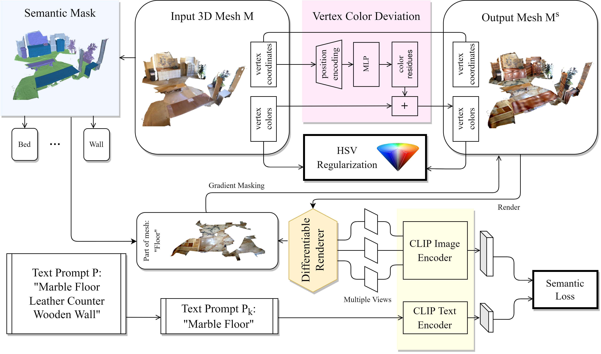
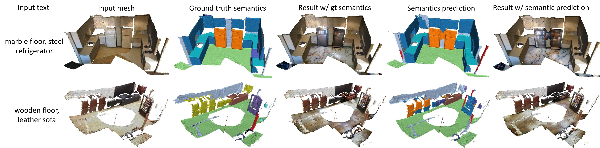

# LASST(Language-guided Semantic Style Transfer of 3D Indoor Scenes)

Created by Xiaoxue Chen, Hao Zhao, Guyue Zhou and Ya-Qin Zhang from Institute for [AI Industry Research(AIR), Tsinghua University](https://air.tsinghua.edu.cn/).

## Introduction
3D content creation and editing is a long-existing multimedia demand. With the surge of metaverse, tech giants and consumers are now looking forward to a high-quality virtual world that people can live in and interactive with. We study the problem of 3D indoor scene style transfer, which would promote the user experience of metaverse residents. 

In this repository, we address the new problem of language-guided semantic style transfer of 3D indoor scenes. The input is a 3D indoor scene mesh and several phrases that describe the target scene. Firstly, 3D vertex coordinates are mapped to RGB residues by a multi-layer perceptron. Secondly, colored 3D meshes are differentiablly rendered into 2D images, via a viewpoint sampling strategy tailored for indoor scenes. Thirdly, rendered 2D images are compared to phrases, via pre-trained vision-language models. Lastly, errors are back-propagated to the multi-layer perceptron to update vertex colors corresponding to certain semantic categories. The whole process of LASST can be seen from below. Code and models will be made publicly available.



## Getting Started
### Installation

```
conda env create --name LASST python=3.7
conda install --yes --file requirements.txt
```

System requirements
### System Requirements
- Python 3.7
- CUDA 11.0
- GPU w/ minimum 8 GB ram

###  Data Preparation
The dataset we used is ScanNetV2 dataset. See [HERE](https://github.com/ScanNet/ScanNet) for more details. Remember to fix the data path in `src/local.py` as your own datapath.


### Run examples
Call the below shell scripts to generate example styles. 
```bash
# wooden floor,steel refridgerator
./scripts/go.sh
```

The outputs will be saved to `results/`.

#### Outputs

<p float="center">


</p>
<p float="center">


</p>
<p float="center">


</p>

<p float="center">


</p>
<p float="center">


</p>
<p float="center">


</p>



<p float="center">


</p>

<p float="center">


</p>

## Citation
```
@article{LASST,
    author = {Bu Jin
              and Beiwen Tian
              and Hao Zhao
              and Guyue Zhou
              },
    title = {Language-guided Semantic Style Transfer of 3D Indoor Scenes},
    year  = {2022}
}
```
